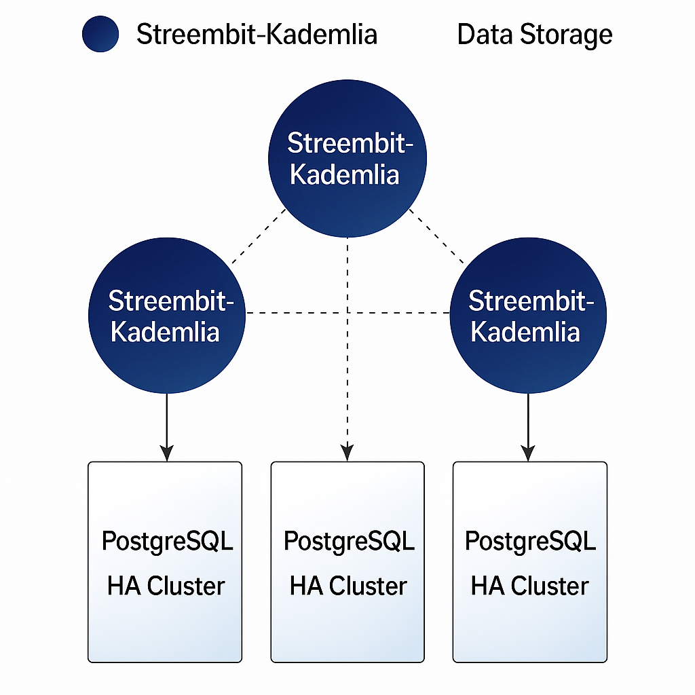

# streembit-db

**streembit-db** is a peer-to-peer key-value database platform that uses the [Kademlia DHT](https://en.wikipedia.org/wiki/Kademlia) to locate and replicate data across a decentralized network, while storing actual records in a local PostgreSQL instance per peer node.

This architecture enables scalable, resilient, and queryable decentralized storage using open standards.

---

Trade some operational complexity for massive scale improvements while keeping PostgreSQL expertise.

---

## Features

- Global key lookup via Kademlia DHT
- Local persistent storage using PostgreSQL
- Structured queries with full SQL and JSONB support
- Replication to k-nearest peers for fault tolerance
- Modular components for API, storage, and networking
- Compatible with PostgreSQL HA setups (e.g., Patroni, repmgr)

---

## Architecture Overview

Each node in the network consists of:

- **Kademlia DHT node** — provides distributed routing and peer discovery
- **PostgreSQL** — stores key-value entries locally, supporting SQL queries
- **API layer** — handles PUT/GET operations and peer sync
- **Replication logic** — replicates each key to `k` nearby nodes in the DHT

For high availability, each PostgreSQL instance can be deployed with clustering tools like Patroni or repmgr.

See the architecture diagram for a visual overview:

